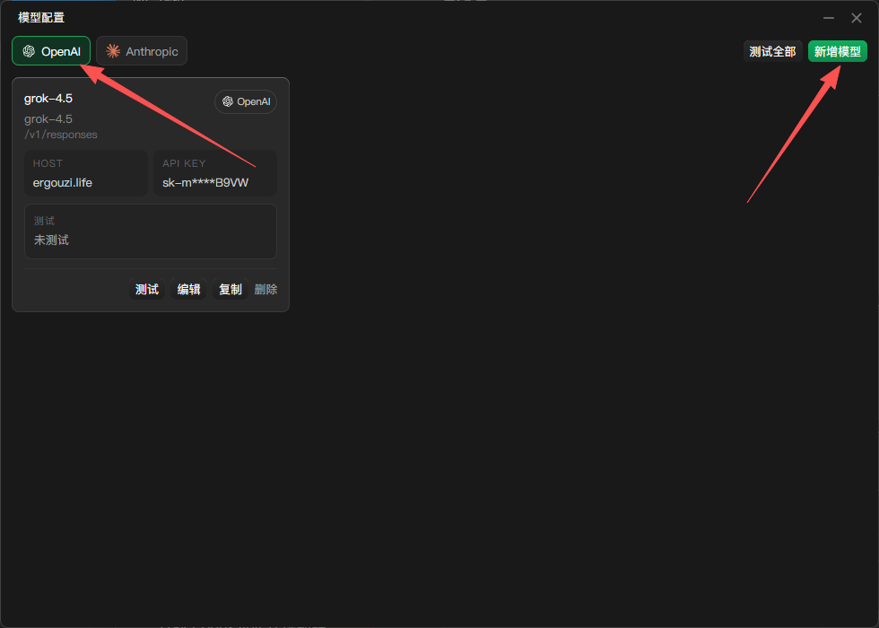
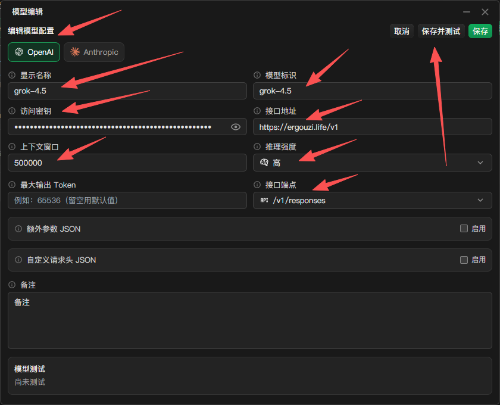

# My Cursor






My Cursor 是一款用于管理 Cursor 本地服务与自定义模型 API 的桌面工具。

## 功能

- 一键启动或停止本地服务，并查看当前运行状态；
- 在本地服务模式与直连 Cursor 模式之间切换；
- 管理 OpenAI、Anthropic 兼容模型的接口地址、密钥、模型标识和请求参数；
- 支持模型配置的新增、编辑、复制、连通性测试和批量测试；
- 展示会话数、Token 消耗、缓存命中率和费用估算；
- 集中管理本地配置、运行日志和版本更新。

## 开发与运行

项目使用 Go、Wails 和 Vue 构建，常用命令如下：

```powershell
task dev
task build
```

构建 Windows 64 位分发包：

```powershell
task build:windows:amd64
```

完整任务定义见 [Taskfile.yml](Taskfile.yml)。

## 本地数据

默认数据目录为 `~/.cursor-local-assistant-v2/`：

- `config.yaml`：运行与模型配置；
- `history/`：会话记录与使用统计；
- `logs/`：运行日志。

## 致谢与许可

本项目基于 [cursor-byok](https://github.com/leookun/cursor-byok) 二次开发，感谢原作者的贡献。

项目遵循仓库中的 [LICENSE](LICENSE)。
